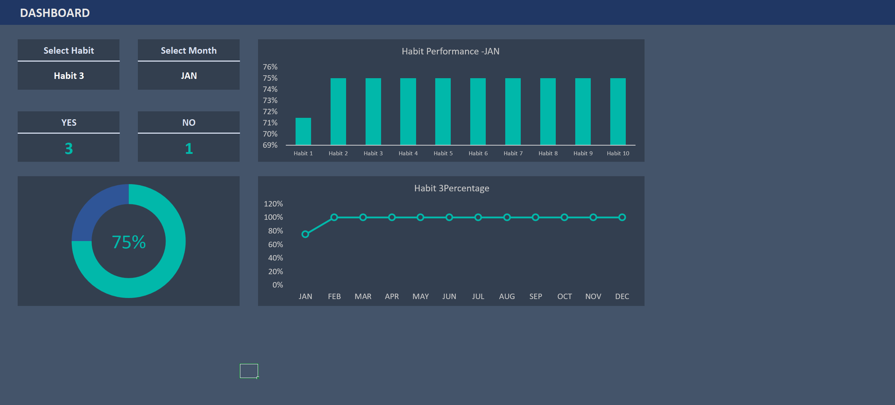
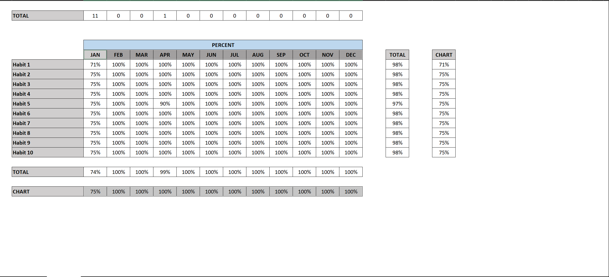
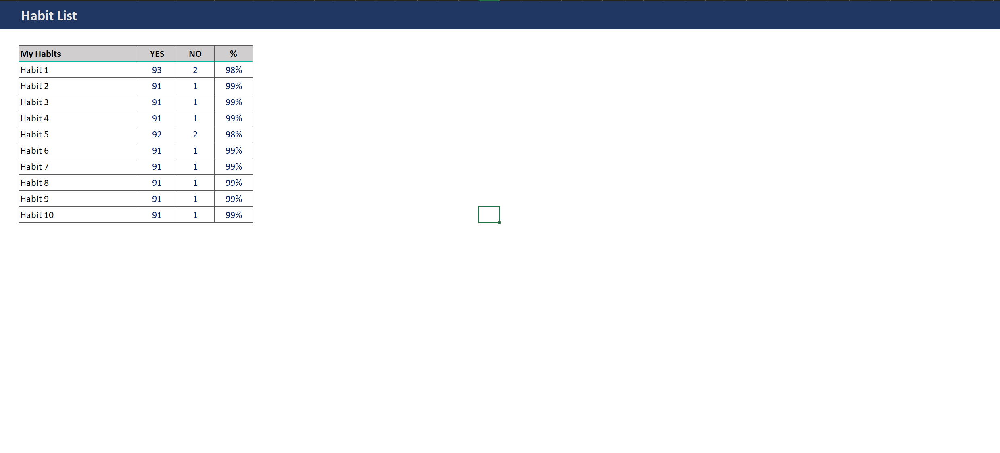

# 📊 Habit Tracker Dashboard (Excel Version)

This is a powerful and visually interactive **habit tracking dashboard** created entirely in **Microsoft Excel**. It allows you to track daily habits, analyze monthly performance, and visualize trends across the year.

---

## 📁 Screenshots

<strong>📸 Dashboard Overview</strong>

- Select a habit and a month
- View YES/NO counters
- Donut chart for success rate
- Bar chart comparing all habits
- Line chart showing year-long progress

<strong>📊 Monthly Habit Percent Table</strong>

- Tracks each habit’s monthly performance
- Automatically calculates percentages
- Feeds dashboard visuals

<strong>📝 Habit List - YES/NO Tracker</strong>

- Tracks lifetime YES and NO counts
- Computes total % success

---

## 🧩 Features

- ✅ Interactive habit and month selection
- 📈 Donut, bar, and line chart visualizations
- 🧮 Monthly percentage calculations
- 🔢 YES/NO tracking with real-time updates
- 📊 Trend analysis across the year

---

## 🧠 How It Works

### 1. Daily Tracking  
Mark whether you completed a habit for the day using "YES" or "NO".

### 2. Monthly Summary  
The backend uses formulas to count total YES/NO and calculate % success for each habit.

### 3. Visual Feedback  
The dashboard dynamically updates charts and stats based on your selections.

---

## 🔍 Example – Habit 3 (JAN)

| Metric         | Value   |
|----------------|---------|
| YES Count      | 3       |
| NO Count       | 1       |
| Success Rate   | 75%     |
| From FEB onward| 100%    |
| Year Trend     | Steady ↑ |

---

## 🛠️ Built With

- 📗 Microsoft Excel
- 🧩 Data Validation (dropdowns)
- 📊 Charts: Donut, Bar, Line
- 🔢 Excel Formulas: `IF`, `COUNTIF`, `% calculations`
- 🎯 Conditional Logic and Named Ranges

---

## 💡 Ideas for Improvement

- ✅ Conditional formatting for <80% performance
- 📝 Add notes or reflections per month
- 📤 Export monthly report as PDF
- 🎯 Add a goal-setting feature

---

## 📌 Use Cases

- Personal habit tracking
- Productivity improvement
- Monthly habit review
- Self-accountability tool

---

## 🧠 Want to Customize?

You can easily:
- Rename the habits in the list
- Add more rows for more habits
- Adjust formulas to suit your style

---

## 📜 License

This project is licensed under the [MIT License](LICENSE).

---

## 🙋 Questions or Suggestions?

Open an [issue](https://github.com/yourusername/Habit-Tracker-Excel/issues) or submit a PR to contribute!

---

